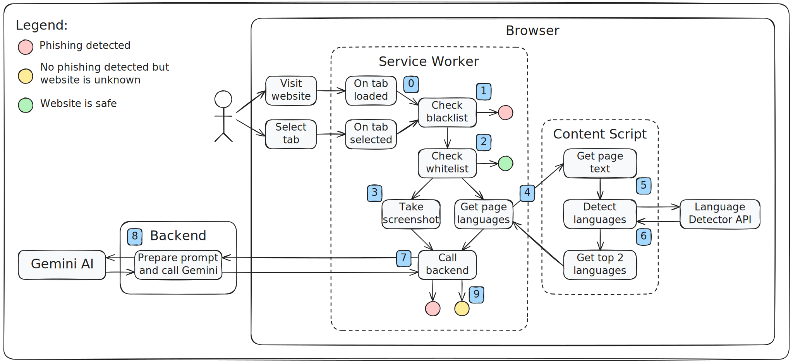

# Anti-Phishing Browser Extension

Innovative browser extension that uses advanced Large Language Models (LLMs) and visual recognition to protect users from phishing attacks. By dynamically identifying sites that mimic legitimate pages, we offer a robust layer of security beyond traditional methods. Designed with privacy and scalability in mind. Join us in making the internet safer, one click at a time!

## How It Works

The extension employs an innovative, visual-based anti-phishing approach that transcends traditional detection methods, which often rely solely on blacklist/whitelist systems or rules based on domain and source code analysis. While these conventional solutions are effective, they struggle with detecting zero-day attacks and can be easily circumvented by tactics such as using standard input fields instead of password fields, or replicating logos with CSS rather than images.

This challenge inspired the development of a purely visual detection method that mimics human behavior by visually identifying websites and verifying if the URL matches before proceeding with information input. This approach excels at detecting zero-day threats and is difficult to bypass, although AI models can still make occasional errors.

To combine the strengths of both methodologies, our solution integrates the visual approach's advantages with traditional blacklisting, ensuring all previously identified threats remain detectable. This hybrid method leverages built-in browser API capabilities to accurately detect the page's language and utilizes Gemini's visual recognition capabilities. To manage costs associated with frequent Gemini calls, the extension incorporates a whitelisting mechanism.

The extension includes 114,399 blacklisted URLs from the Phishfort list and 2,683,642 whitelisted URLs from Tranco, Cisco, and BuiltWith. This dual approach not only conserves computational resources on user devices but also minimizes LLM call frequency, ensuring robust protection when necessary. Historically, hybrid solutions that blend various methods have proven most effective. As LLMs improve, this solution may eventually operate entirely on users’ machines, enhancing efficiency and security.

## A Picture Is Worth Thousands of Words

This diagram describes the novel approach that the extension uses to detect phishing attacks:

<ol start="0">
  <li>The user selects a tab or loads a new page</li>
  <li>
    The extension checks if the visited url is present in the blacklist with dangerous websites
    <ul>
        <li>If the website is found in the list the user is redirected to a warning page</li>
        <li>If the website is not blacklisted the extension proceeds with the next checks</li>
    </ul>    
  </li>
  <li>
    The extension checks if the visited url is present in the whitelists with safe websites
    <ul>
        <li>If the website is found in the lists the user is allowed to visit the page without further checks being conducted</li>
        <li>If the website is not whitelisted the extension proceeds to the AI assisted validation</li>
    </ul>   
  </li>
  <li>When the webpage is fully loaded the extension uses the built-in browser API to take a screenshot of the site</li>
  <li>The service worker sends a request to a content script to identify the language used in the page contents (this needs to be done by a content script due to unresolved a bug in the browser API)</li>
  <li>The content script uses the built-in AI language detector in the browser to find which languages are used in the page contents</li>
  <li>The top 2 languages are selected and passed back to the service worker</li>
  <li>The service worker makes a call to the extension's backend and sends the visited url, the screenshot and the detected languages</li>
  <li>The backend uses the configured Gemini model to decide if the visited website is dangerous or not</li>
  <li>Based on the response of the backend the extension can redirect the user to a warning page if the visited website looks suspicious or let the user browse if the page is safe</li>
</ol>

## Setup Local Environment

To try out the extension you will need to build it in development mode and run the backend. I have also provided 3 example phishing pages you can visit and test the approach. Please follow the instructions in the corresponding readmes:

- Extension: [README.md](./extension/)
- Backend: [README.md](./backend/README.md)
- Examples: [README.md](<[./backend/README.md](https://github.com/kmanev073/google-chrome-built-in-ai-challenge/tree/main/examples#readme)>)
